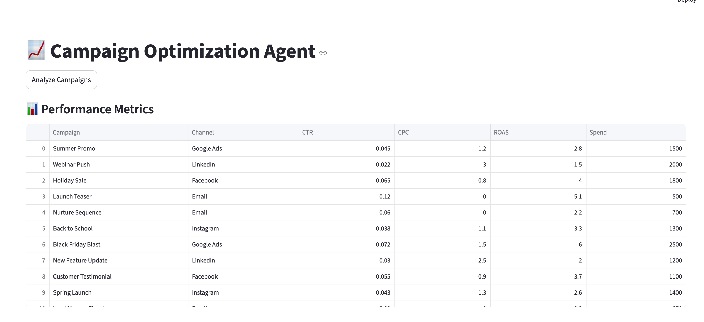
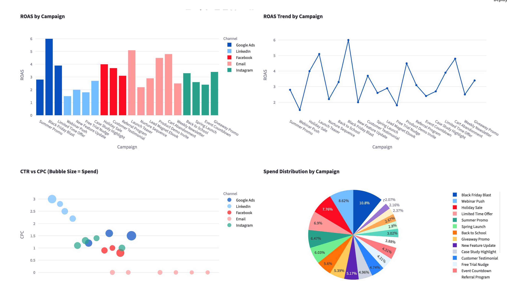
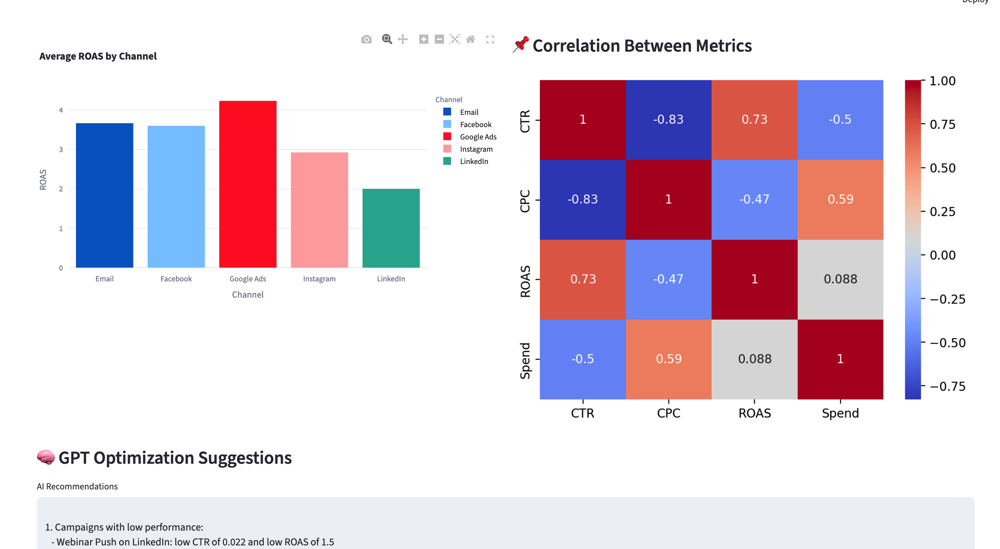
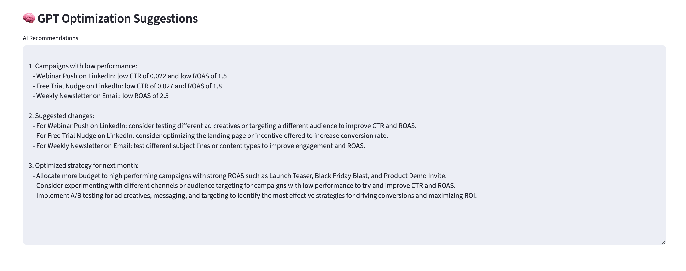

# 📈 Campaign Optimization Agent

This project analyzes marketing campaign performance using data and AI-powered insights. It generates interactive visualizations and GPT-driven recommendations to help optimize spend, improve CTR, and increase ROAS.

## 🖼️ Screenshots

### 1. App Dashboard (Homepage UI)
The initial layout where users can click "Analyze Campaigns" to process campaign data.

---

### 2. Campaign Performance Visualizations
Bar charts, scatter plots, and pie charts illustrate performance metrics such as ROAS, CTR vs CPC, spend distribution, and channel-wise ROAS.

---

### 3. GPT Recommendations
AI-generated text-based optimization suggestions are displayed for strategic decision-making.

---

## 📊 Key Visualizations Included
- ROAS by Campaign
- CTR vs CPC (Bubble Chart)
- Spend Distribution (Pie Chart)
- ROAS Trend Line
- Average ROAS by Channel
- Metric Correlation Heatmap

