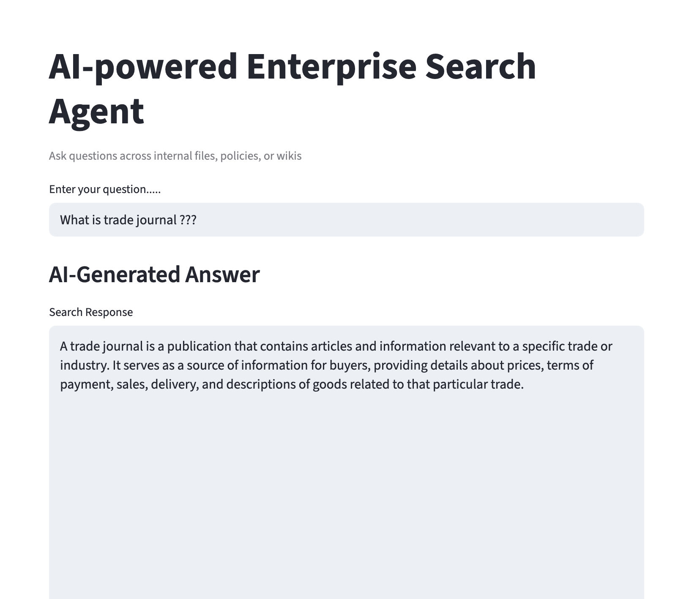

# AI-powered Search Agent

### Overview
The AI-powered Search Agent enhances traditional search functionality by offering context-aware, natural language query handling across enterprise documents, emails, reports, and wikis. Instead of keyword matching, it uses semantic search to understand intent and retrieve the most relevant answers. In this lab, you’ll build an agent that indexes internal documents and answers user questions using GPT and vector search.

---

### Lab Objectives
By the end of this lab, you will:
- Load and embed company documents (PDFs, text files, or markdown)
- Use a vector database for fast retrieval
- Ask natural language queries and get GPT-generated answers
- Provide source snippets to build trust and traceability

---

### Project Structure
- `docs/` — Folder containing your PDF/TXT/MD documents  
- `search_index/` — Saved FAISS vector index  
- `ui.png` — Screenshot of the UI  
- `embedding_docs.py` — Script to process & index documents  
- `search_agent.py` — Script to query the FAISS index  
- `app.py` — Optional UI (Streamlit or Flask)  
- `.env` — Environment variables (contains `OPENAI_API_KEY`)  
- `requirements.txt` — Python dependencies  

